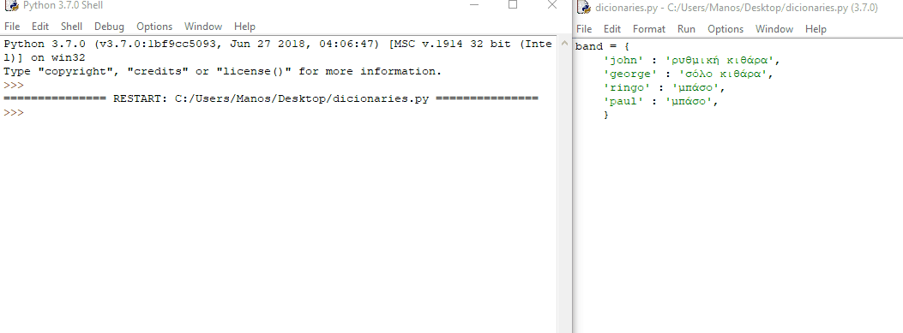

Ένα λεξικό είναι ένας τύπος δομής δεδομένων της Python. Περιέχει μια σειρά από ζεύγη. Το κάθε ζεύγος αποτελείται από κλειδί : τιμή. Εδώ είναι ένα πολύ απλό παράδειγμα:

```python
band = {'john' : 'ρυθμική κιθάρα', 'paul' : 'μπάσο', 'george' : 'σόλο κιθάρα', 'ringo' : 'μπάσο'}
```
Το λεξικό έχει ένα όνομα, στη συγκεκριμένη περίπτωση `band`, και τα δεδομένα σε αυτό περιβάλλονται από άγκιστρα (`{}`). Στο λεξικό υπάρχουν τα ζεύγη κλειδιών : τιμών. Σε αυτήν την περίπτωση τα **κλειδιά** είναι τα ονόματα των μελών της μπάντας. Οι **τιμές** είναι τα ονόματα των οργάνων που παίζουν. Τα κλειδιά και οι τιμές έχουν μεταξύ τους μία άνω κάτω τελεία (`:`), και κάθε ζεύγος διαχωρίζεται με κόμμα (`,`). Μπορείς επίσης να γράψεις λεξικά όπου το κάθε ζευγάρι κλειδιού: τιμής γράφεται σε μια νέα γραμμή.

```python
band = {
    'john' : 'ρυθμική κιθάρα',
    'paul' : 'μπάσο',
    'george' : 'σόλο κιθάρα',
    'ringo' : 'μπάσο'
    }
```

- Άνοιξε το IDLE, δημιούργησε ένα νέο αρχείο και προχώρησε στη δημιουργία του δικού σου λεξικού. Μπορείτε να χρησιμοποιήσεις το παραπάνω ή το δικό σου αν προτιμάς. Όταν τελειώσεις, αποθήκευσε και εκτέλεσε τον κώδικα. Στη συνέχεια πήγαινε στο περιβάλλον της python και δες το αποτέλεσμα πληκτρολογώντας το όνομα του λεξικού σου.

    

- Ίσως θα παρατηρήσεις ότι τα ζεύγη κλειδιών : τιμών δεν είναι πλέον με τη σειρά που τα πληκτρολόγησες. Αυτό οφείλεται στο γεγονός ότι τα στοιχεία ενός λεξικού στην Python δεν είναι **σε καθορισμένη σειρά**, επομένως δεν μπορείς να εντοπίζεις κάποιο συγκεκριμένο στοιχείο του λεξικού με βάση τη συγκεκριμένη θέση του.

- Για να αναζητήσεις μια συγκεκριμένη τιμή σε ένα λεξικό μπορείς να χρησιμοποιήσεις το κλειδί του. Έτσι, για παράδειγμα, εάν θέλεις να μάθεις ποιο όργανο παίζει ο `ringo`, μπορείς να πληκτρολογήσεις:

    ```python
    band['ringo']
    ```
- Τα λεξικά μπορούν να αποθηκεύσουν όλους τους τύπους δεδομένων. Έτσι μπορείς να τα χρησιμοποιήσεις για να αποθηκεύσεις αριθμούς, συμβολοσειρές, μεταβλητές, λίστες ή ακόμα και άλλα λεξικά.
