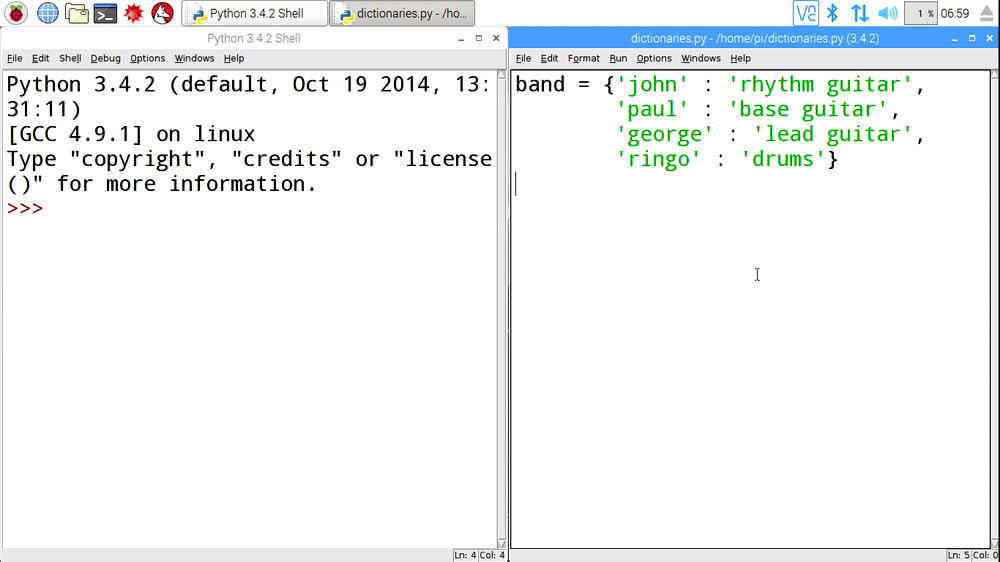

A dictionary is a type of data structure. A dictionary contains a series of key / value pairs. Here is a very simple example of a dictionary in Python

```python
band = {'john' : 'rhythm guitar', 'paul' : 'base guitar', 'george' : 'lead guitar', 'ringo' : 'base guitar'}
```

The dictionary has a name, in this case `band`, and the data within it is surrounded by curly brackets (`{}`). Within the dictionary are the key : value pairs. In this case the **keys** are the names of the band members. The **values** are the names of the instruments they played. Keys and values have colons between them (`:`), and each pair is separated by a comma (`,`). You can also write dictionaries so that each key : value pair is written on a new line.

```python
band = {
    'john' : 'rhythm guitar',
    'paul' : 'base guitar',
	'george' : 'lead guitar',
    'ringo' : 'base guitar'
	}
```

- Open IDLE and in a new file, have a go at creating your own dictionary. You can use the one above or your own if you like. When you're done, save and run the code and then switch over to the shell to have a look at the result, by typing the name of your dictionary.

	

- You'll probably notice that the key : value pairs are no longer in the order that you typed them. This is because Python dictionaries are **unordered**, so you can't rely on any particular data being in any specific position.

- To look up a particular value in a dictionary you can use the key. So for instance, if you wanted to find out what instrument `ringo` plays, you could type:

	```python
	band['ringo']
	```
- Dictionaries can store all types of data. So you can use a dictionary to store numbers, strings, variables, lists or even other dictionaries.

*[data structure]: A method of storing and organising data.
*[key]: A unique identifier for some data.
*[value]: The data to be stored.
