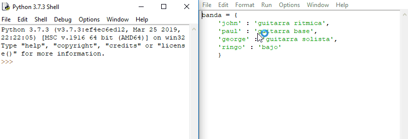

Un diccionario es un tipo de estructura de datos en Python. Contiene una serie de pares de clave : valor. Aquí hay un ejemplo muy simple:

```python
banda = { 'john': 'guitarra rítmica', 'paul': 'guitarra base', 'george': 'guitarra solista', 'ringo': 'bajo'}
```
El diccionario tiene un nombre, en este caso `banda`, y los datos que contiene están entre llaves (`{}`). Dentro del diccionario están los pares de clave : valor. En este caso, las **claves** son los nombres de los miembros de la banda. Los **valores** son los nombres de los instrumentos que tocan. Las claves y los valores tienen dos puntos entre ellos (`:`) y cada par está separado por una coma (`,`). También puedes escribir diccionarios de modo que cada par de clave : valor esté escrito en una nueva línea.

```python
banda = {
    'john' : 'guitarra rítmica',
    'paul' : 'guitarra base',
    'george' : 'guitarra solista',
    'ringo' : 'bajo'
    }
```

- Abre IDLE, crea un nuevo archivo e intenta crear tu propio diccionario. Puedes usar el ejemplo de arriba o uno propio si lo deseas. Cuando hayas terminado, guarda y ejecuta el código. Luego cámbiate al shell para ver el resultado escribiendo el nombre de tu diccionario.

    

- Probablemente notarás que los pares de clave : valor ya no están en el orden en que los escribiste. Esto se debe a que los diccionarios de Python son **desordenados**, de modo que no se pueda confiar en que una entrada en particular esté en una posición específica.

- Para buscar un valor específico en un diccionario, puedes usar su clave. Entonces, por ejemplo, si quisieras saber qué instrumento toca `ringo`, podrías escribir:

    ```python
    banda['ringo']
    ```
- Los diccionarios pueden almacenar todo tipo de datos. Por lo que puedes usarlos para almacenar números, cadenas de caracteres, variables, listas e incluso otros diccionarios.
